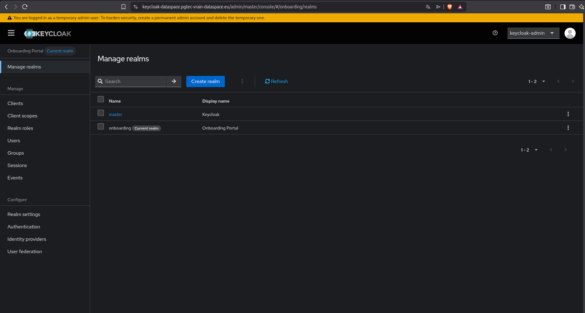
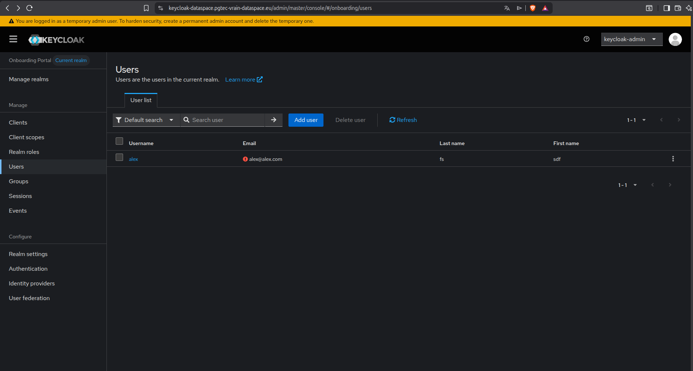
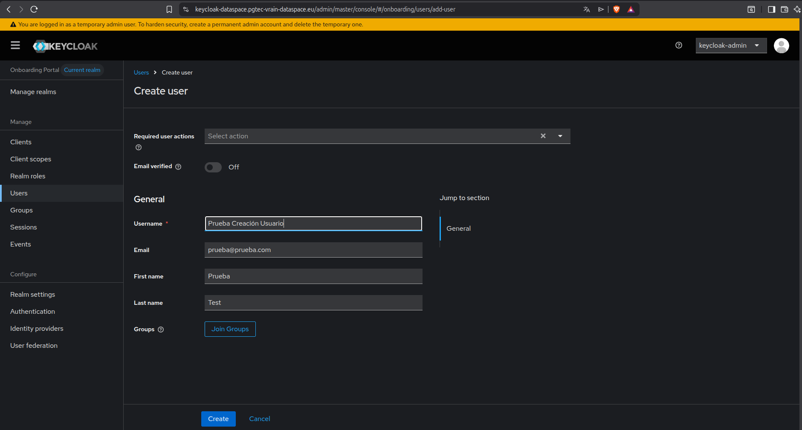
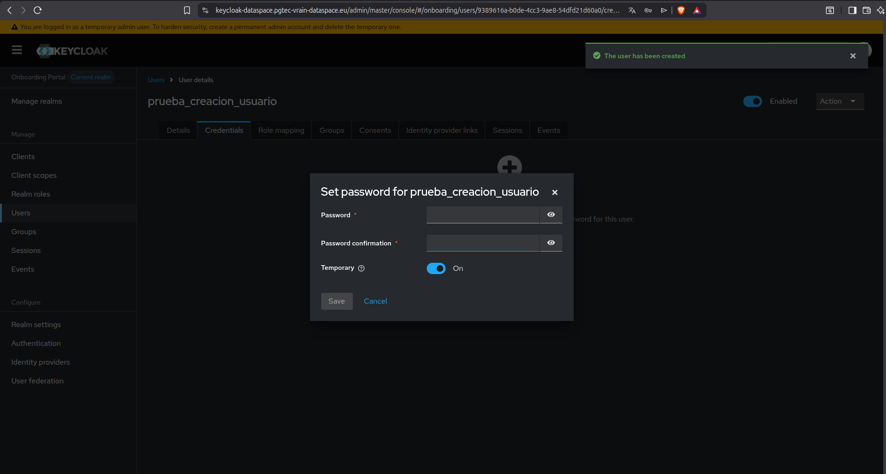
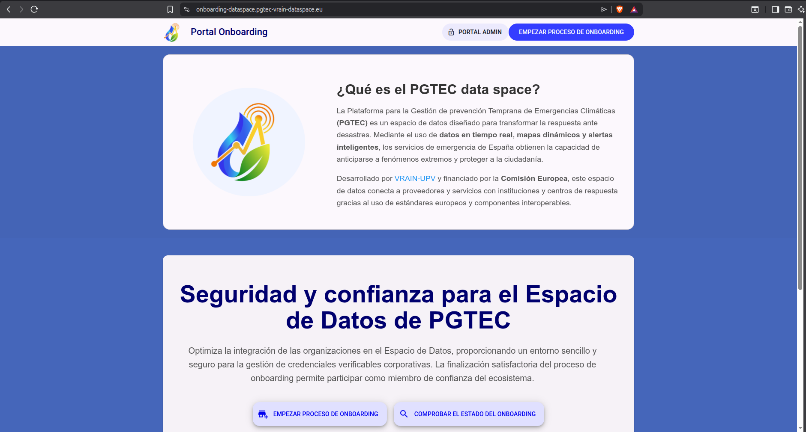
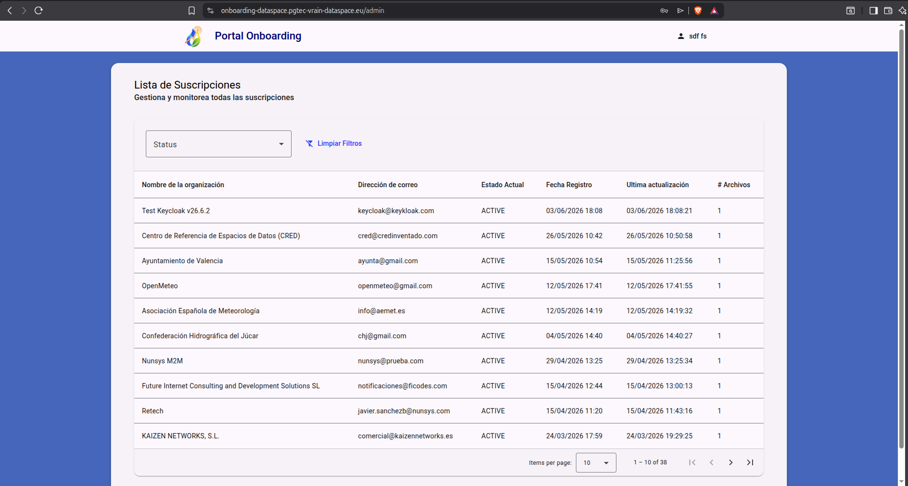

## Introduction

This section describes the steps that the data space administrators must follow to create users within the user management service, which in the case of the data space is Keycloak. To do this, the following steps must be followed:

### 1. Access to the Administration Portal

The first step is to access the [Administration Portal](https://keycloak-dataspace.pgtec-vrain-dataspace.eu). 

### 2. Access to Keycloak

To access Keycloak, administrator credentials must be presented. In the case of the PGTEC data space, the credentials are saved in Kubernetes secrets named 
*issuance_secret*. Therefore, you must access the Kubernetes *namespace* where Keycloak resides and obtain the credentials through the aforementioned secret. With them, you can proceed to log in.

Once inside Keycloak, the first step is to select the *Provider* realm. The realm is a namespace used to group users, roles, and clients in an isolated manner. The image shows this action:

### 3. User creation in Keycloak

Once the *onboarding* realm is chosen, the next step is to go to the left side menu and select *Users*. In this section, you can create the users with which an administrator will be able to access the Onboarding administration portal to approve or deny requests to access the data space. 

To do this, click on the *Add User* button located at the top right. The following screenshot shows the side menu that includes the *Users* button and the *Add User* button:

After clicking on *Add User*, you must fill in the necessary fields to create the user. Among them are the username and email, as shown in the following image:

Once the user is created, a password must be created for it. To do this, access the *Credentials* section located in the top menu: 

For the password to last indefinitely, the *Temporary* option can be disabled. After that, the credentials are obtained to access the Onboarding portal as an administrator and analyze the requests to access the ecosystem.

### 4. Access to the administration portal as a user

To access the administration portal as a user, you must first access the Onboarding Portal. From this portal, you can access the administration portal by clicking on the button in the upper right part that says *Admin Portal* as shown in the following image:  

It is important to emphasize that this button accesses the administration portal as a user since it accesses the *onboarding* realm directly and not the *admin* administration realm. Therefore, from this button on the onboarding portal, you cannot log in as an administrator. To do this, you must access the administration portal directly.

Finally, once logged in with the newly created user and password, you can see the requests to access the ecosystem:

!!! Tip "More Info"

    To confirm that a user has been registered in the ecosystem, you can access the Trust Anchor and check if the Decentralized Identifier of the accepted user is registered in the Trust Anchor.

    To do this, you can access the following link: [Trust Anchor](https://trustanchor-dev.pgtec-vrain-dataspace.eu/v4/issuers/). 

    In addition, it can also be accessed via Linux terminal as follows:

    curl -s "https://trustanchor-dev.pgtec-vrain-dataspace.eu/v4/issuers?page%5Bsize%5D=100" | jq '[.items[].did]' 