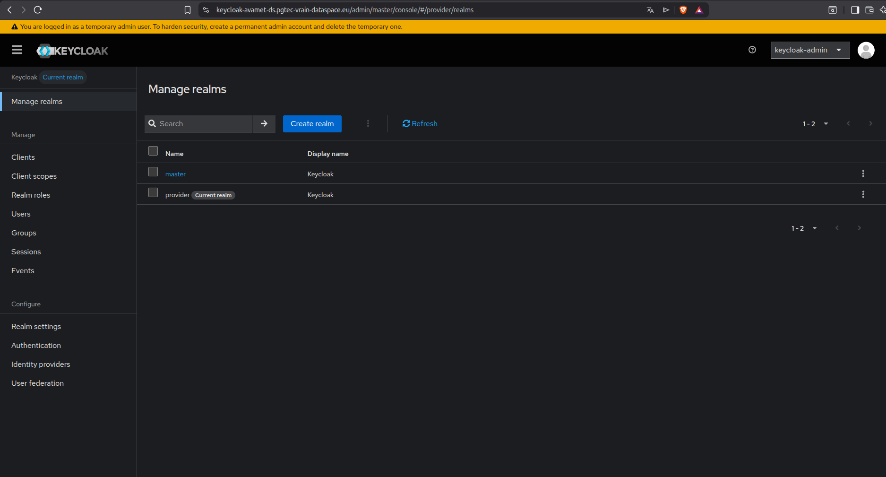
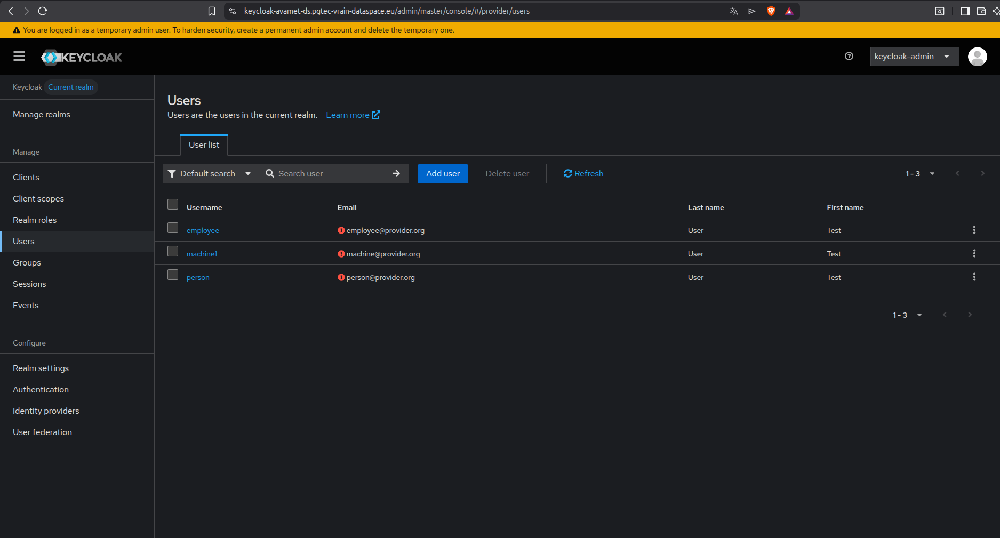
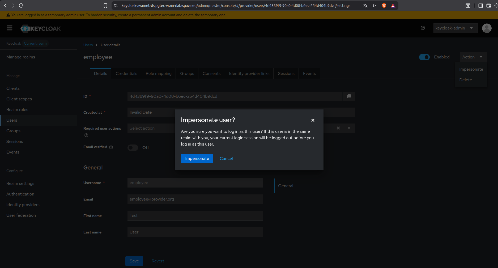
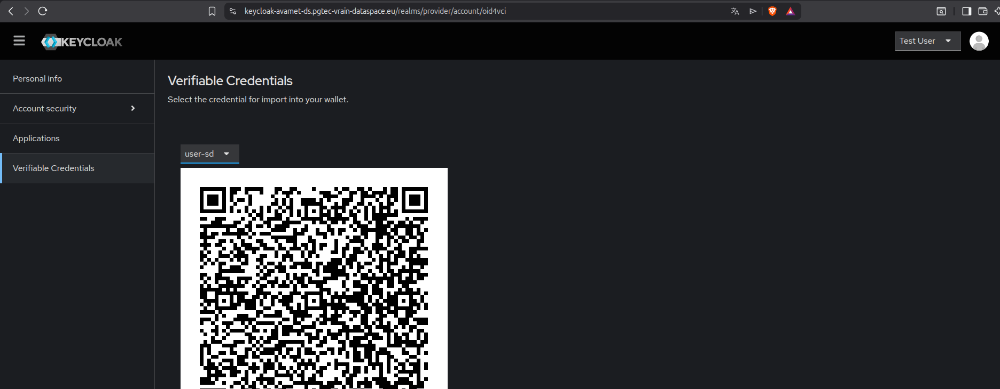
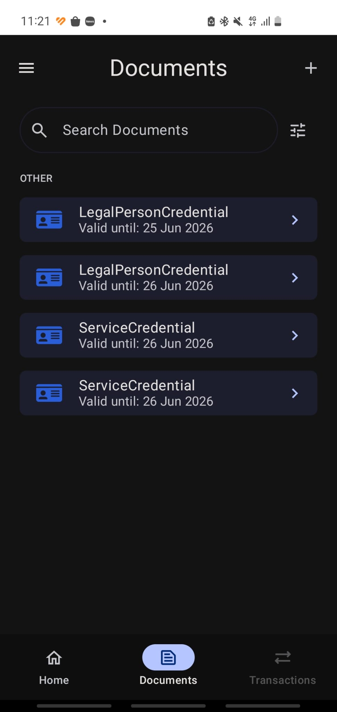
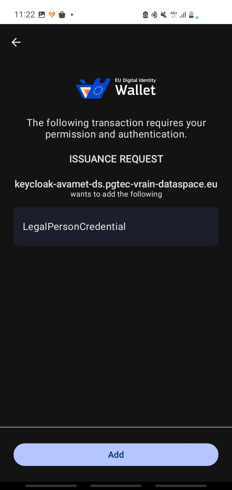

## Introduction

This section describes the process for obtaining verifiable credentials within the PGTEC Data Space. This process involves two main components:

- **Keycloak**: User management service where verifiable credentials are generated through the [OID4VC](https://openid.net/specs/openid-4-verifiable-credential-issuance-1_0.html) (OpenID for Verifiable Credential Issuance) plugin.
- **EUDI Wallet**: The [European Digital Identity Wallet](https://ec.europa.eu/digital-building-blocks/sites/spaces/EUDIGITALIDENTITYWALLET/pages/694487738/EU+Digital+Identity+Wallet+Home) that stores and manages the verifiable credentials on the user's device.

## Components

- **Keycloak**: An open-source Identity and Access Management solution that, combined with the OID4VC protocol extension, acts as a credential issuer for the data space. Each participant in the data space has a dedicated Keycloak instance deployed for its own users.

- **EUDI Wallet**: A mobile application compliant with the EU Digital Identity framework that allows users to receive, store, and present verifiable credentials in a secure and standardised way.

## Credential Issuance Process

The following steps describe how a data space participant can obtain a verifiable credential through Keycloak and store it in the EUDI Wallet. The example below uses **AVAMET** as the data space participant.

### 1º: Access the Keycloak instance and select the realm

The first step is to access the Keycloak instance deployed for the participant. In the case of AVAMET, the instance is available at [https://keycloak-avamet-ds.pgtec-vrain-dataspace.eu/](https://keycloak-avamet-ds.pgtec-vrain-dataspace.eu/). Once on the login page, the **provider** realm must be selected from the realm selector dropdown:

### 2º: Access the user and impersonate

Once inside the provider realm, navigate to the **Users** section in the left-hand menu and select the user for whom the credential needs to be issued:

To act on behalf of that user, click the **Impersonate** button. This allows the administrator to access the user account and generate a credential on their behalf:

### 3º: Issue the credential and scan with the EUDI Wallet

Once impersonating the user, navigate to the **Verifiable Credentials** section and select the desired credential configuration. Keycloak will generate a QR code that must be scanned by the EUDI Wallet:

To add the credential, open the **Documents** section of the EUDI Wallet application and tap the **+** icon in the upper right corner:

Scan the QR code displayed in Keycloak and confirm the credential offer. The verifiable credential will then be stored securely in the wallet:

!!! note "Migration to FIWARE connector 10.0.0"

    The example shown in this section is based on the **FIWARE connector version 8.5.0**. The project is currently migrating to **version 10.0.0**.

    The Keycloak UI remains largely unchanged between versions, so the steps described above are still applicable. However, the wallet layer is evolving: newer wallets are supported in version 10.0.0, such as the [Lissi ID Wallet](https://www.lissi.id/), which provides an improved user experience for both iOS and Android devices, as well as broader standards compliance.
