## Introduction

The PGTEC Data Space includes a central marketplace where data providers can publish their data and services as governed offers. Publishing an offer makes a resource discoverable by consumers and enforces the access policies defined by the provider, including credential requirements and ODRL usage policies.

This section describes the full process for publishing a data offer in the marketplace. The example below uses **IIAMA** as the data provider participant.

The publication process consists of three main stages:

1. Creating a **Product Specification** defines what is being offered and its access policies.
2. Creating a **Catalogue** groups one or more offers under a named collection.
3. Creating a **Product Offer** ties the specification and catalogue together into a published, consumable offer.

## Publishing a Data Offer

### 1º: Login to the Marketplace

Access the central marketplace and log in using the verifiable credential stored in the provider's wallet. The login flow relies on the OID4VC protocol, so the user must present the credential issued by their Keycloak instance (see [Keycloak & EUDI Wallet](keycloak.md)):

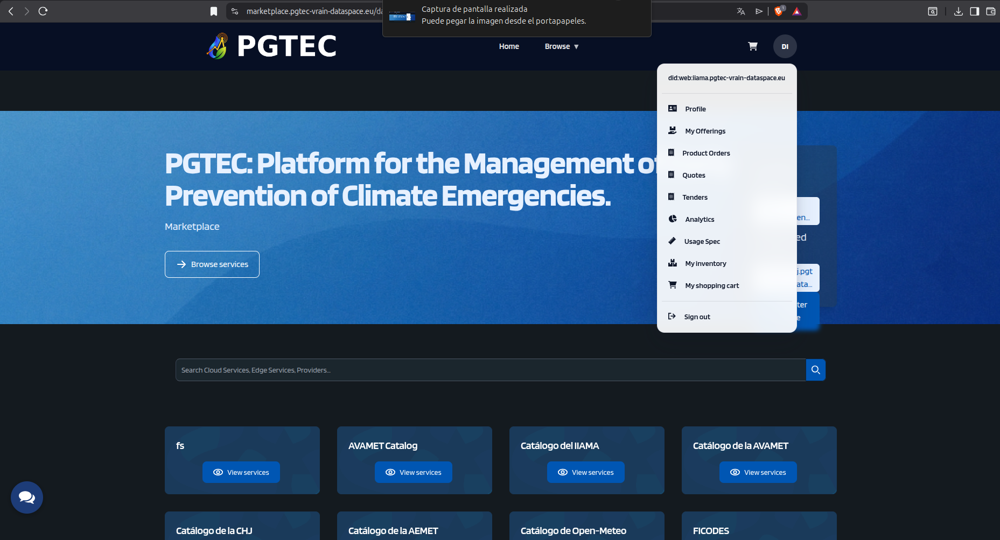

Once logged in, open the user dropdown and navigate to the **My Offerings** section.

### 2º: Create a Product Specification

A Product Specification describes the resource being offered - its metadata, features, and access policies.

From the **My Offerings** section, select **Product Specification** in the left-hand menu:

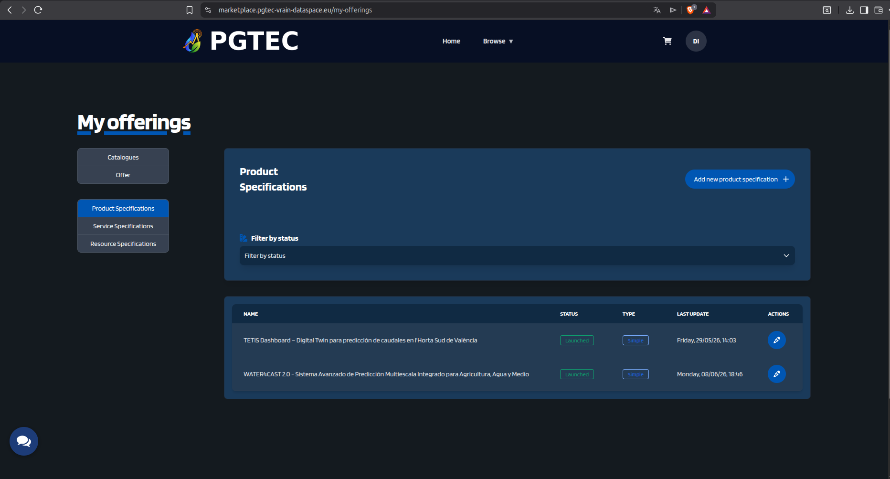

Click the **Add New Product Specification +** button. In the first step, fill in the title and description of the specification:

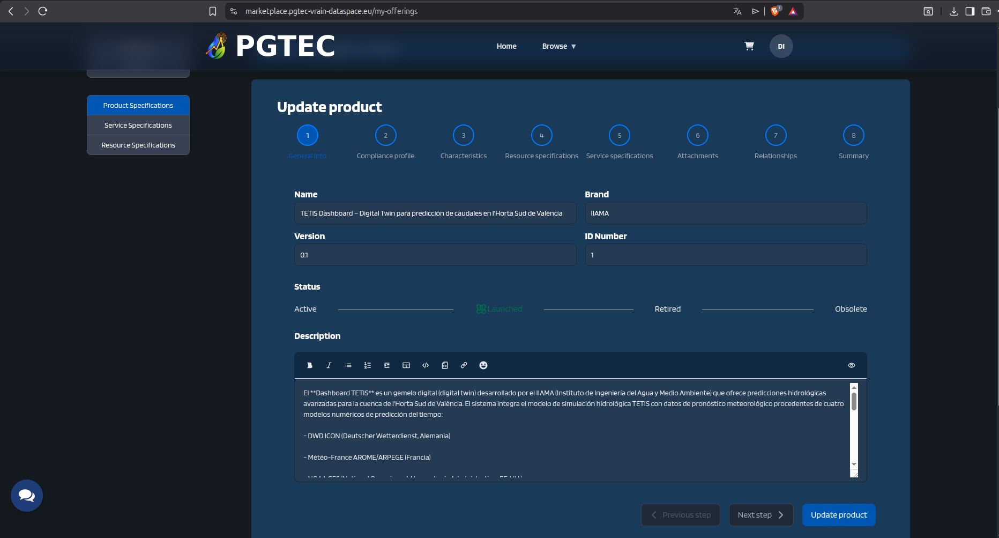

Proceed to step 3 to define the product features. Two relevant features can be added:

- **Credentials Configuration**: links the specification to the provider's Credential Config Service, defining the credential type and role required to access the service.
- **Authorization Policy**: attaches an ODRL policy that restricts who can access the data or service. Both features require uploading a JSON file describing the credential requirements, roles, and access conditions.

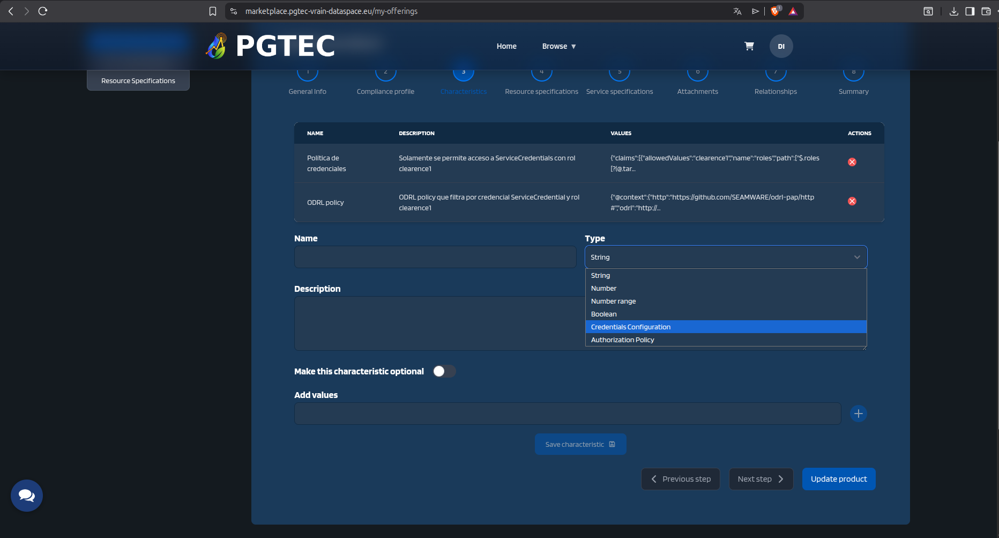

In step 5, an optional representative image can be added to the product:

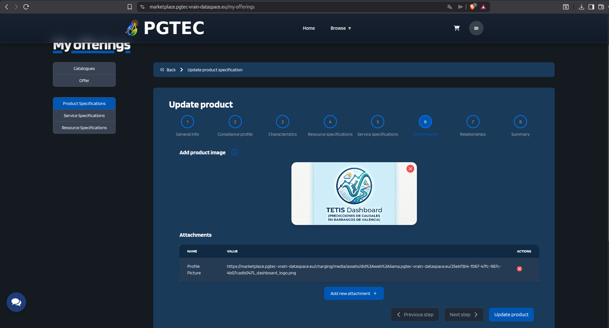

Step 8 displays a full summary of the specification before saving:

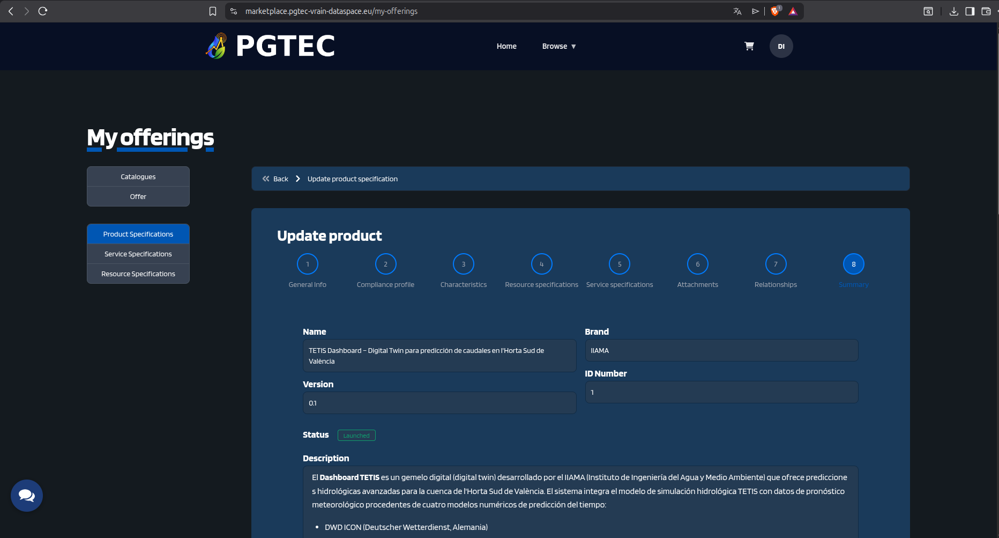

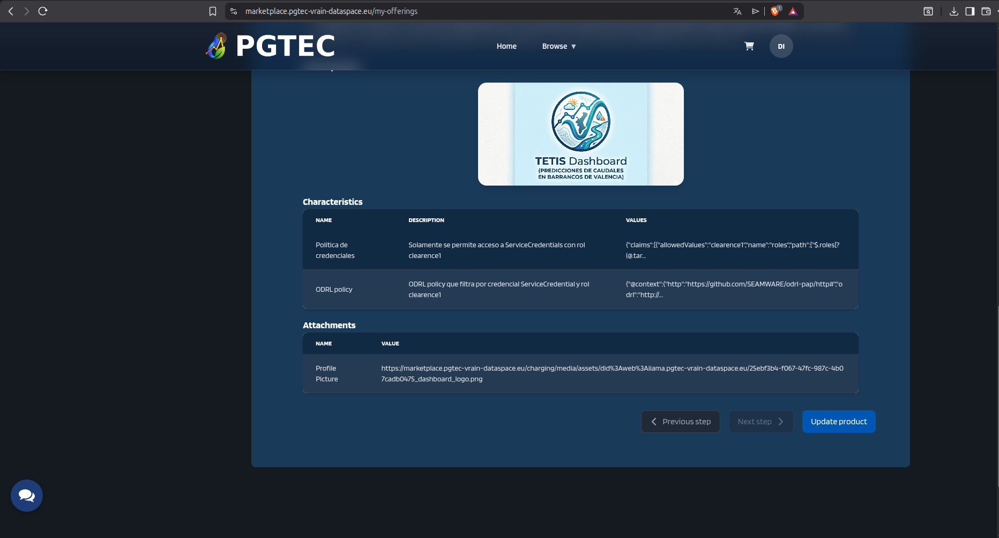

!!! warning "Set the Product Specification to Launched"

    After saving, the specification is created with **Active** status, which means it is not yet usable by a Product Offer. To make it available, open the specification again using the **Update** button, change its status to **Launched**, and save the changes:

    

    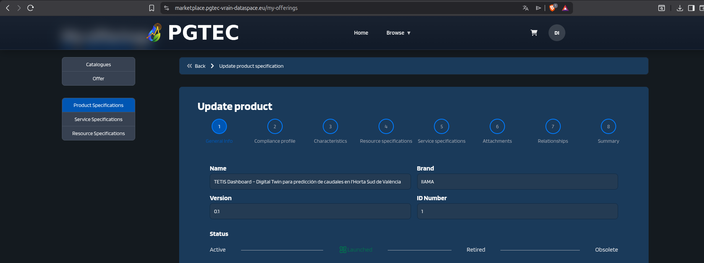
    

### 3º: Create a Catalogue

A Catalogue groups one or more product offers under a named collection visible in the marketplace.

From the **My Offerings** section, select **Catalogues** in the left-hand menu:

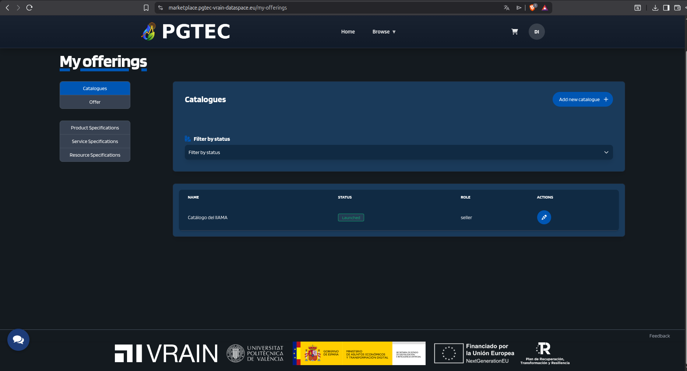

Click **Add New Catalogue +** and fill in a title and description:

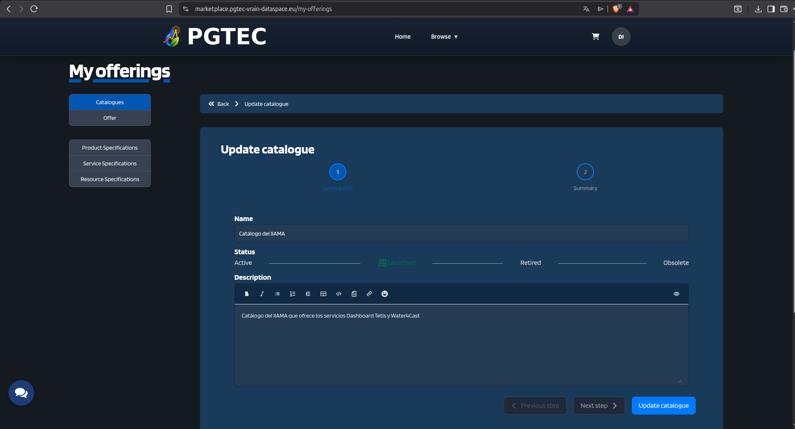

!!! warning "Set the Catalogue to Launched"

    As with the Product Specification, the catalogue is created with **Active** status. It must be updated to **Launched** before it can be associated with a Product Offer and made visible in the marketplace.

### 4º: Create a Product Offer

The Product Offer is the published entry in the marketplace. It links the Product Specification and Catalogue together and defines the terms under which consumers can request access.

From the **My Offerings** section, select **Product Offer** in the left-hand menu and click **Add New Product Offer +**:

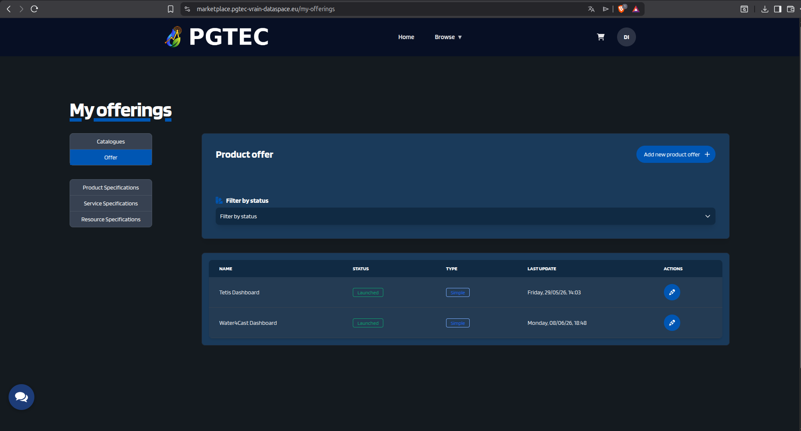

**Step 1** - Define the title and description of the offer:

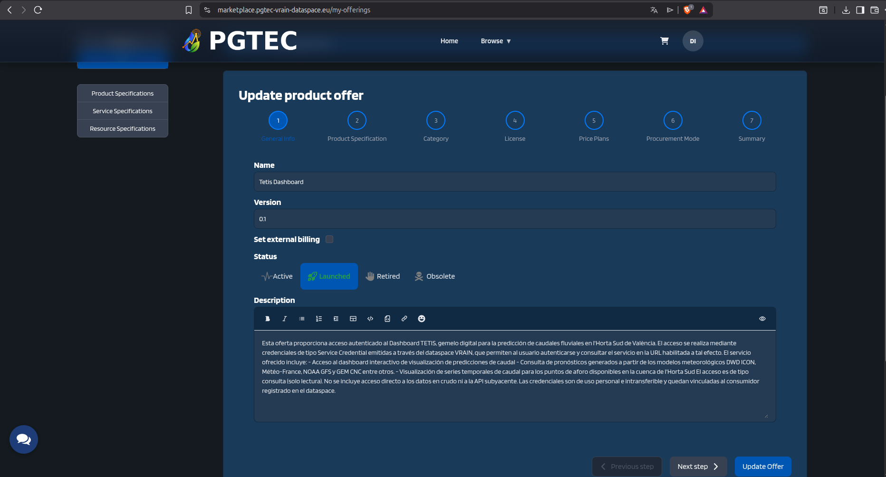

**Step 2** - Associate the offer with the Product Specification created in the previous stage:

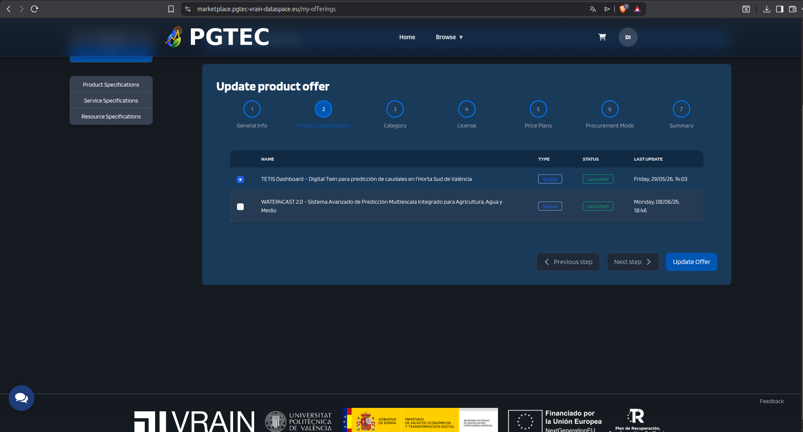

**Step 3** - Associate the offer with the Catalogue:

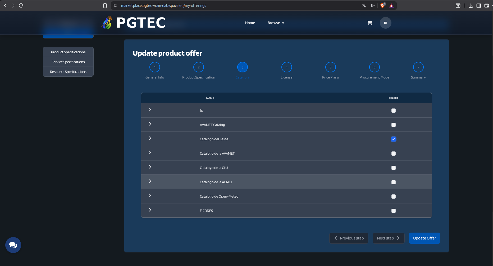

**Step 4** - Add the terms and conditions of use that any consumer must accept before requesting the offer:

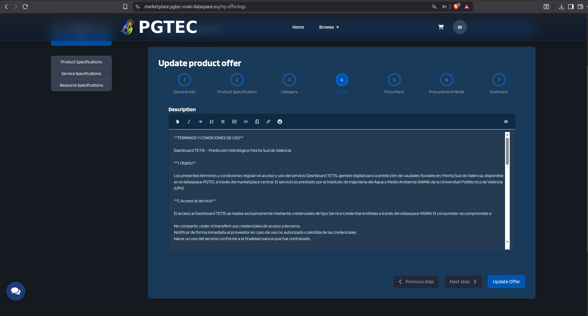

**Step 5** - Review the summary of the Product Offer before saving:

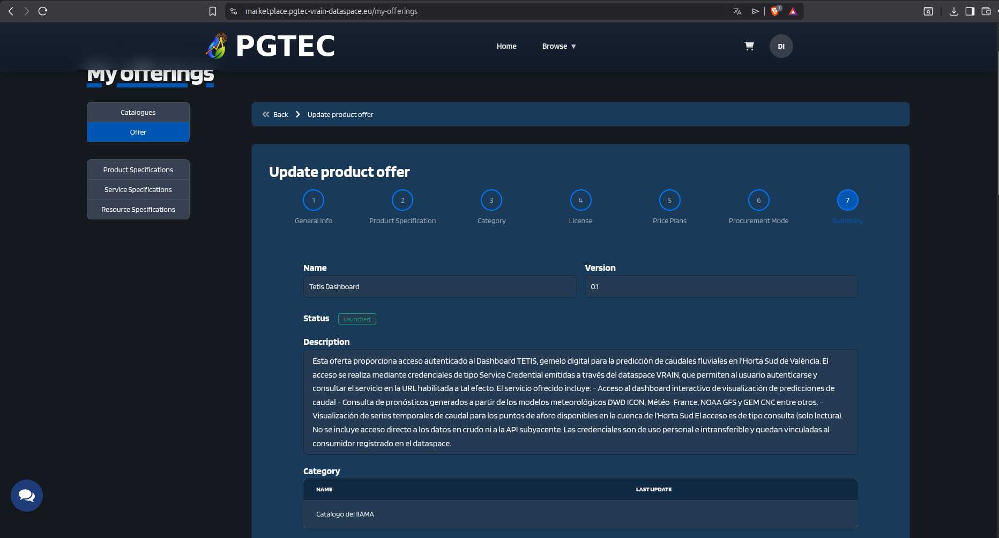

!!! warning "Set the Product Offer to Launched"

    Once created, the offer will have **Active** status and will not yet be visible to consumers. Open the offer and update its status to **Launched** to publish it in the marketplace:

    

    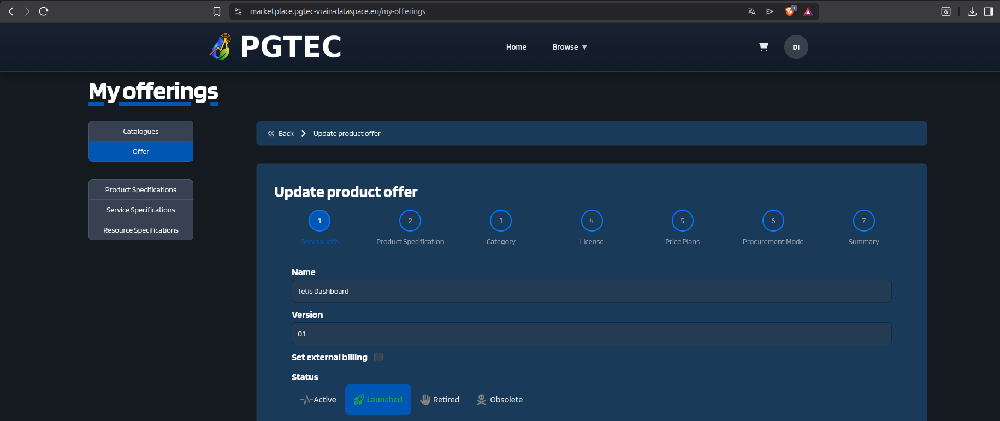
    

    Only after this step will the offer appear in the marketplace and be accessible to data consumers.

## Example: PGTEC Marketplace

As an example, the following screenshot shows several climate data and service offers published by different participants of the PGTEC Data Space:

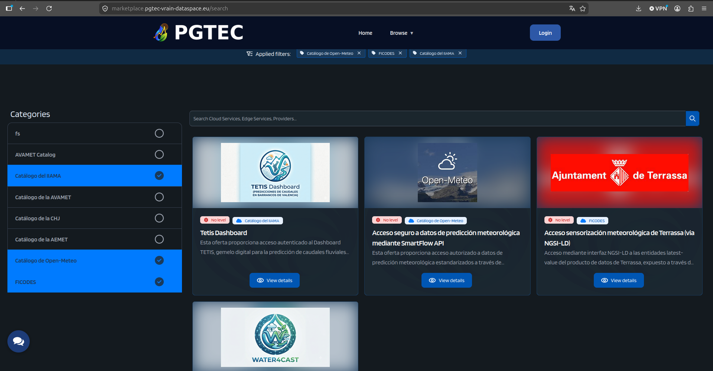

