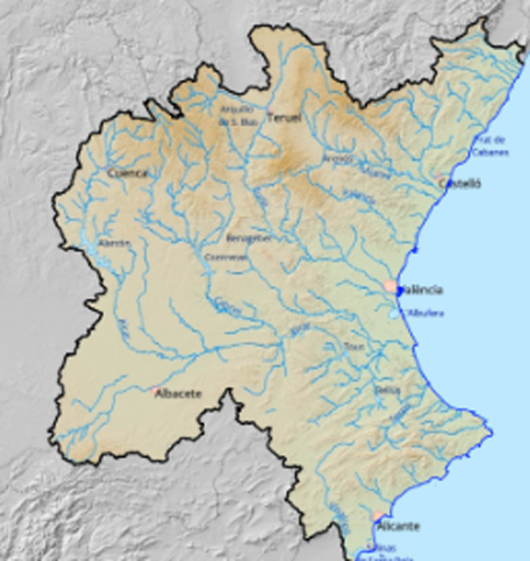

# Confederación Hidrográfica del Júcar – SAIH 

The **Júcar Hydrographic Confederation (CHJ)** is the public body responsible for water management in the Júcar River Basin District, which covers a large part of the Valencian Community and areas of Castilla La Mancha, Aragon and Cataluña. Its mission is to ensure sustainable water use, prevent risks associated with droughts and floods, and protect river ecosystems. 

{ width="560" }

The Júcar Automatic Hydrological Information System (SAIH) is a technological network managed by the CHJ that collects real-time hydrological, hydraulic and meteorological data from across the entire basin. It consists of automatic sensors, measuring stations and a control centre that processes the information. Through the SAIH Júcar, the CHJ offers a comprehensive information system that connects institutional management with real-time monitoring technology. 

The SAIH collects data from three types of stations: 

- **Gauges**: measure the flow rate in rivers, tributaries and watercourses. They provide essential data for forecasting floods, assessing droughts and determining the availability of water resources. 

- **Reservoirs**: record the volume of water stored, total capacity and daily variations. Key information for resource management, flood control and agricultural and urban planning.

- **Rain gauges**: collect accumulated precipitation at different time intervals. This allows for analysis of rainfall distribution and anticipation of extreme events. 

## API

The CHJ does **not have a public API**, although it does have a public dashboard, allowing access to all information without any verification via [SAIH](https://saih.chj.es/mapa-lluvias).

To access SAIH data via its private API, you must contact the CHJ and make the relevant request.

??? info "More information"
    To access **SAIH** data through its private API, you must contact the CHJ and make the relevant request. 
    After this, you will obtain a username and password with which we will generate an authorisation token 
    that will be used to authenticate future requests.  

    In addition, **you must be able to access their private network**, specifically port 8000, either through 
    the IP whitelist or via a VPN connection.  

    The API address is: [https://api-saih.chj.es:8000](https://api-saih.chj.es:8000).  

    A graphical interface for the API is also available through the open source swagger tool.  
    It can be accessed at [https://api-saih.chj.es:8000/docs](https://api-saih.chj.es:8000/docs).

Through the API, we can access **real-time data** from different sensors, updated every five minutes, which for the purposes of the project are classified into three types: 

- **Rain gauges**: these record accumulated rainfall in 1h, 4h, 12h and 24h and their operational status. 

- **Gauges**: measure instantaneous flow with reference thresholds (low, medium and high) along with the date of the last measurement.  

- **Reservoirs**: report the elevation (metres above sea level (m a.s.l.)), the stored volume (hm³) and the inflow and outflow rates (m³/s).  

| Reservoirs | Gauges | Rain gauges |
|:-------|:-------|:-------|
| 25  | 180 | 78 |

In addition to real-time data, the Júcar Hydrographic Confederation also has **historical data**, although this is not accessible via API as it is not stored in a unified database but distributed across different time series. However, it is possible to perform an initial dump of this information into the platform's database, which would allow for its integration and subsequent exploitation. 
