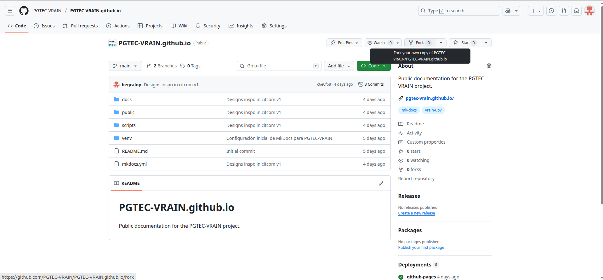
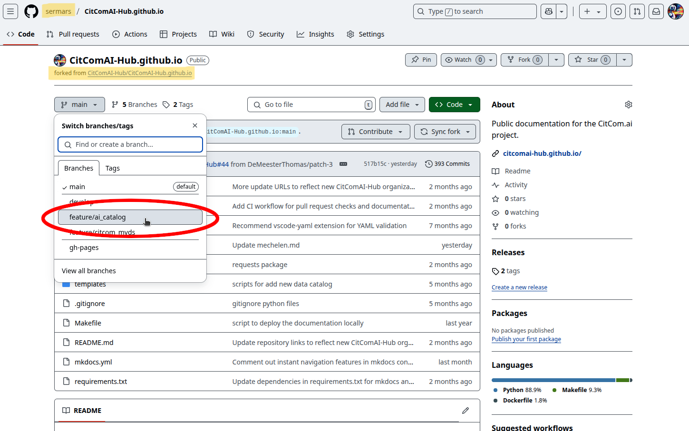
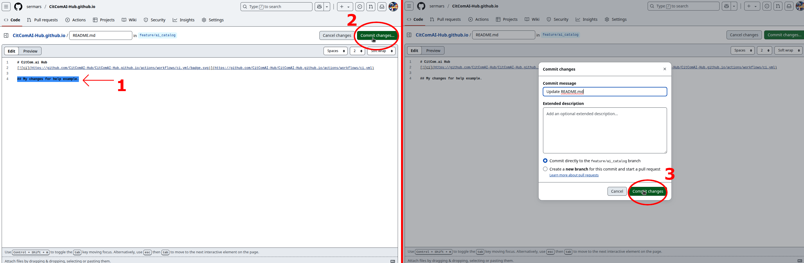
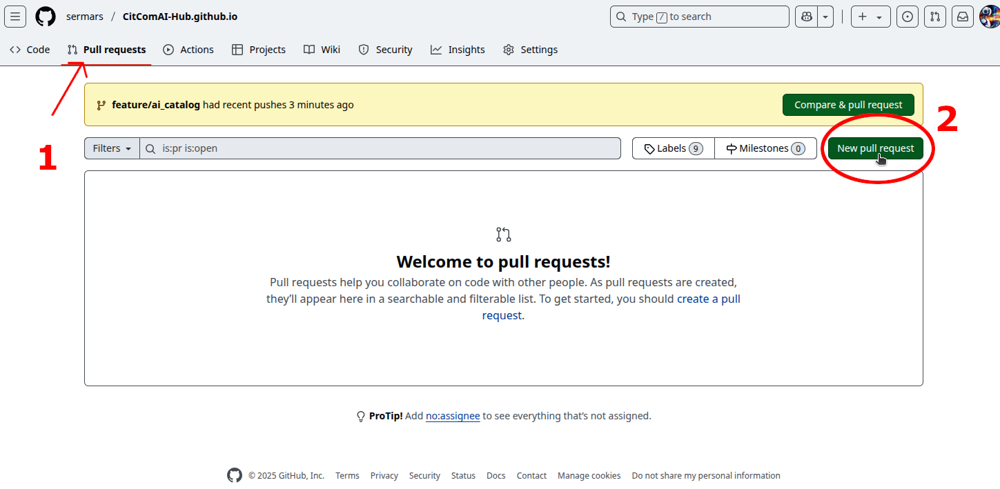
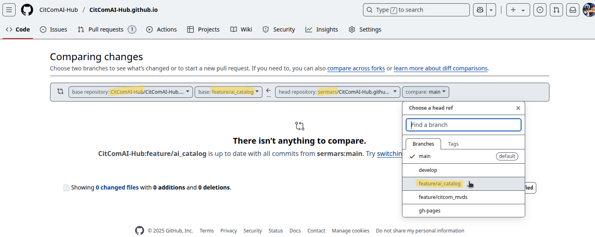
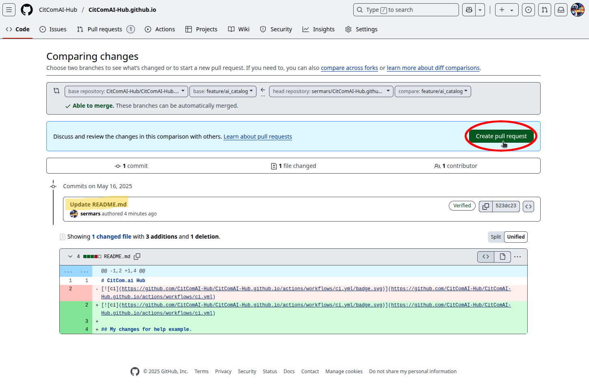

# Request changes: Pull Request Procedure

By default, Citcom.ai Hub is an open portal where anyone can publish changes. However, these changes must be made in a controlled manner through a review process ([*pull-request*](https://docs.github.com/pull-requests)).

## 1. Fork of the Citcom.ai Hub repo

The first step to editing the content of Citcom.ai Hub is to have a copy of it in our personal GitHub account. This is done by creating a **Fork** from the [GitHub repository](https://github.com/CitComAI-Hub/CitComAI-Hub.github.io).

1. While logged into GitHub, click on the icon labeled `Fork`.
    1. (*Optional*) Deselect the checkbox if you want all branches of the repository to be copied.
2. Create the fork.

 

## 2. Selecting the branch to edit

From our fork of the Citcom.ai Hub repository, if needed, we can switch to any branch.

!!! success "Verification of the fork"

    You can verify that you are in the fork by checking that you are in your personal account, and below the repository name, it states that it has been **forked** from citcom.ai.

## 3. Editing the content  

Make the necessary changes and commit them.

## 4. Publishing the changes for review (Pull Request)

From our forked repository, go to the `Pull requests` tab (1) and select the option to create a `New pull request` (2).

!!! warning "IMPORTANT"

    Select the correct branch to which you want to publish the changes. In this case:

    |                 |            *Repository name*                   |  *Branch name*  |
    |----------------:|:----------------------------------------------:|-----------------|
    | **Destination** |      `CitComAI-Hub/CitComAI-Hub.github.io`     | `<branch_name>` |
    |    **Origin**   | `<github_account_name>/CitComAI-Hub.github.io` | `<branch_name>` | 

    *Verify that the names of the destination branch and the source branch are the same.*

    

Lastly, verify that the commits containing all the changes you made are visible, then create the pull request. If it has been correctly created, you will see your pull-request appear in the repository `CitComAI-Hub/CitComAI-Hub.github.io` for review and publication on the official Citcom.ai Hub portal.

