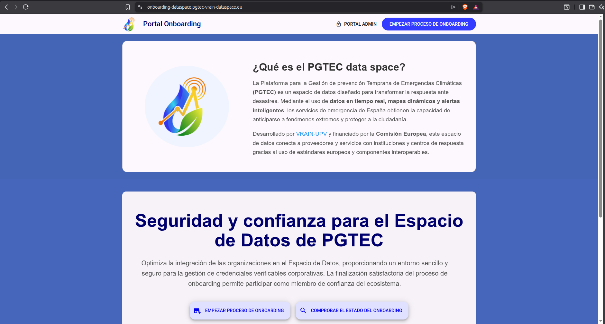
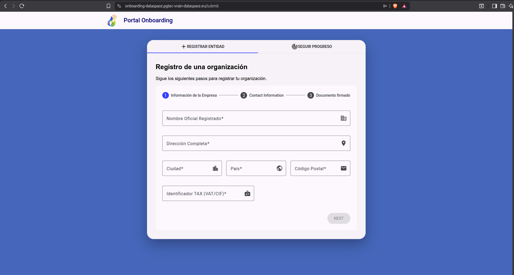
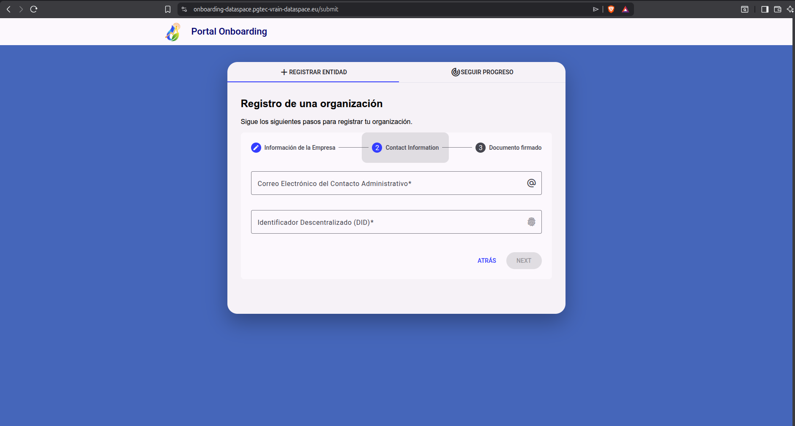
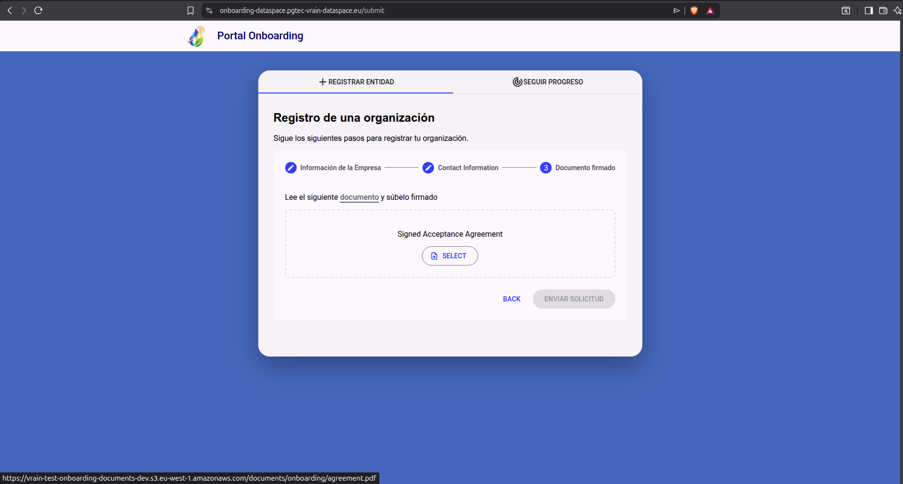
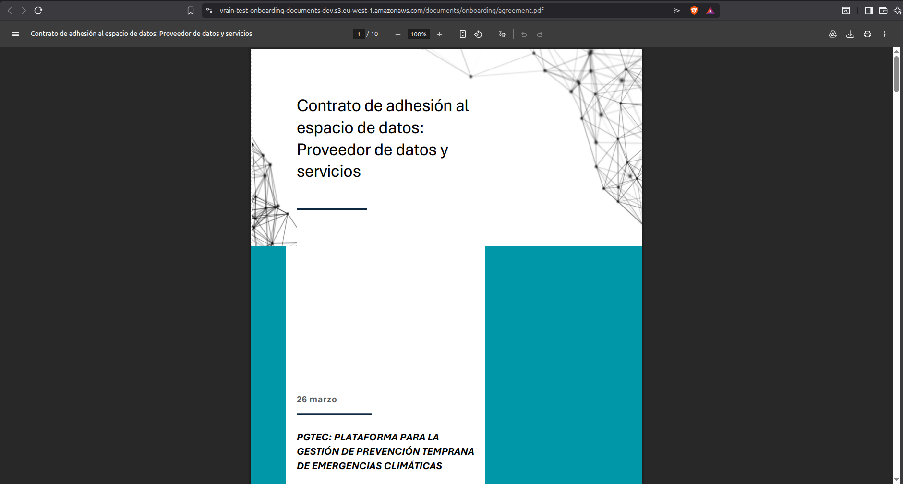
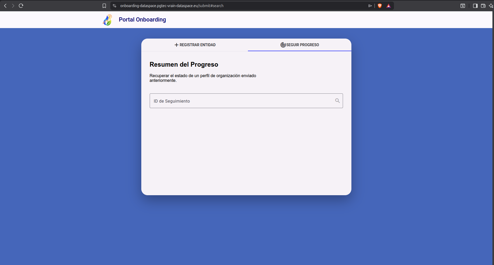

## Introduction

Would you like to join the data space? The first step is to request access. It’s simple, but important: it helps us maintain a secure ecosystem where only organisations that meet our requirements can participate.

In this section, we show you how to request it step by step through the Onboarding portal.

## Steps

Below is a step-by-step explanation of how to request membership for any participant who wants to be part of the ecosystem:

### 1. Access the Onboarding Portal

The first step is to access the [Onboarding website](https://onboarding-dataspace.pgtec-vrain-dataspace.eu).

### 2. Start the Onboarding Process

After entering the website, click on the *Start Onboarding Process* button located at the top of the page. Once you do, a form appears where each participant must fill in the requested fields. Specifically, the fields to fill are:

- Official Organization Name
- Address
- City
- Country
- Postal Code
- TAX Identifier

The following screenshot shows the fields to fill visually:

After filling in the above fields, click the next button to access the next part of the form. In this section, you must add two fields:

- Email Address
- [Decentralized Identifier](../DataSpace/did.md): Only **did:web** type is accepted in the ecosystem

Once you have filled in these fields, click the *next* button to access the final part of the form. It contains the data space membership agreement. Each participant must carefully read the terms and conditions before requesting access. If you agree, you must download the agreement and sign it digitally. Once done, you must upload the signed document. The following screenshot describes this section:

By way of detail, the following screenshot shows the first page of the PGTEC membership agreement:

After submitting the signed membership agreement, the Onboarding process is complete.

### 3. Track Your Application Status

Once you have submitted your membership request, you must wait for the data space administrators to review your submission and decide whether to accept or deny it.

At the end of the onboarding process, each participant receives an ID that identifies the request created. With it, you can check the status of your request in real-time by tracking it through the *Track Process* feature available in the form. To access the tracker, you can use the following [link](https://onboarding-dataspace.pgtec-vrain-dataspace.eu/submit#search). The following screenshot shows it:

!!! Tip "Next Steps"

    While your access request is being reviewed, you can check out the products and services offered by the PGTEC data space by visiting the [marketplace](https://marketplace.pgtec-vrain-dataspace.eu).

    If you want to learn more details about the participants that are part of the data space, you can access the following [link](../data_sources/index.md)