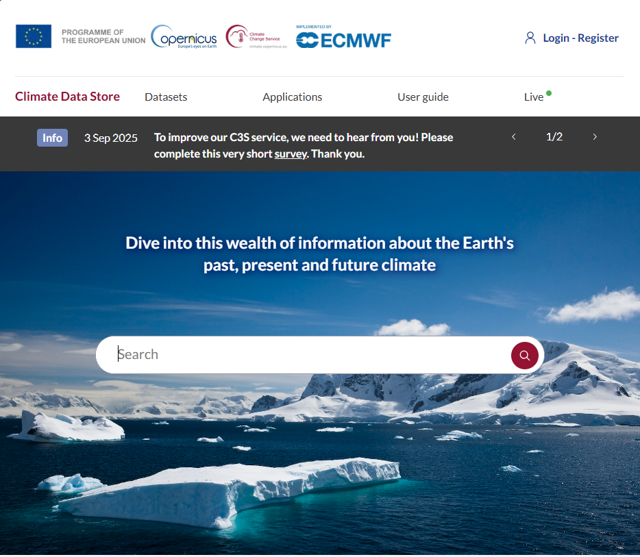
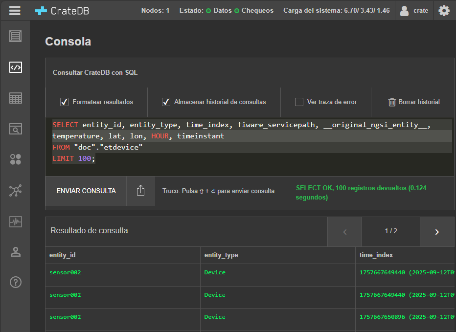

# Example

This is an example to use the environment using the Copernicus data as an example with the DAG:

**flujo_coperniocus_orion_quantumleap.py**

## Instructions

1. Get a free Copernicus Climate Data Store API Key at [Copernicus Climate Data Store](https://accounts.ecmwf.int/auth/realms/ecmwf/protocol/openid-connect/auth?client_id=cds&scope=openid%20email&response_type=code&redirect_uri=https%3A%2F%2Fcds.climate.copernicus.eu%2Fapi%2Fauth%2Fcallback%2Fkeycloak&state=Xg5O4h6pHkITloRNwM5IoSGizKWVJdZZWFjve1aYvRA&code_challenge=sQXDzVNLTvWQw-UYP30kS46kCP0d9j06JF2xmBy5KgY&code_challenge_method=S256)

{ width="1000" }
2. Clone the repository 
```
git clone https://github.com/PGTEC-VRAIN/Entorno-AirFlow_IotAgent_OrionLD_QuantumLeap.git
```
3. Run Docker service
```
sudo service docker start
```
4. Access to the correct repository with the environment Entorno-AirFlow_IotAgent_OrionLD_QuantumLeap
```
cd Entorno-AirFlow_IotAgent_OrionLD_QuantumLeap
```
5. Change API Key at the script **flujo_coperniocus_orion_quantumleap.py**
```
 c = cdsapi.Client(url="https://cds.climate.copernicus.eu/api",
                   key="PUT_YOUR_API_KEY_HERE")
```
6. Run the docker compose yaml
```
docker compose up --build
```
7. Check the status of the containers in a new terminal
```
docker ps
```
8. Access to [Airflow](http://localhost:8080/) to see the DAG running (You may create an account first)
{ width="1000" }
9. Check [CreateDB](http://localhost:4200/) to get historical data You may create an account first
{ width="1000" }
10. Shut down the docker
```
docker compose down
```