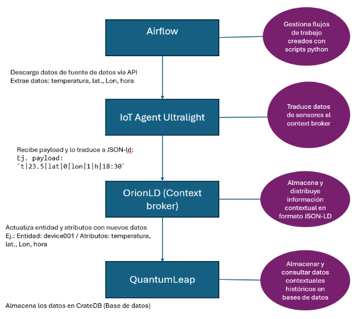

## Overview

The **data space** aims to centralise and standardise climate information from various sources so that it is available to organisations interested in early prevention of climate emergencies.

The **first** phase in building the data space is **data collection**. To do this, it is not enough to simply collect information from different sources: it is necessary to ensure that the data is updated in real time, is in a standardised format and is easily accessible to different organisations and applications.

To this end, a structured data flow is designed that covers several consecutive stages, from obtaining the data at source to its storage and distribution in the data space. This flow ensures that each piece of data collected goes through a process of capture, translation, standardisation, management and historical persistence, so that it can ultimately be integrated correctly and consistently into the data ecosystem.

### Components of the data flow

- **[Airflow](https://airflow.apache.org/):** An orchestration tool that allows you to schedule and automate data collection tasks. It is responsible for periodically executing scripts that query APIs or download files from different sources.

- **[IoT Agent Ultralight](https://fiware-tutorials.readthedocs.io/en/latest/iot-agent.html):** Acts as a translator for the data received. It converts information from sensors or APIs into a common, standardised format (in this case based on FIWARE Smart Data Models), ensuring consistency in variable names and units of measurement.

- **[Orion-LD (Context Broker)](https://fiware-orion.readthedocs.io/en/master/):** Core of the system. It manages, stores and distributes contextual information in JSON-LD format, allowing data to be queried in real time by different applications or services.

- **[QuantumLeap](https://quantumleap.readthedocs.io/en/latest/user/using/):** Component specialised in historical storage. It receives data from the Context Broker and stores it in a temporary database, in this case CrateDB, thus facilitating its consultation and subsequent use for analysis, report generation or artificial intelligence model training.

### Stages of data flow

- **Data collection:** Climate data is collected periodically from different sources, mostly through REST APIs, although some comes from direct downloads from web pages. This process is automated with Apache Airflow, which, thanks to the use of DAGs (Directed Acyclic Graphs) in Python, allows dependencies to be defined, execution to be scheduled (e.g., hourly) and regular, reliable data updates to be ensured.

- **Standardisation and translation:** Each source uses different variables and formats, so it is necessary to unify names, units, and structures. This task is performed by the IoT Agent, which translates the information into common models defined by FIWARE's Smart Data Models. In this case, a climate model is used to ensure data interoperability for future applications.

- **Contextual management and distribution:** Standardised data is managed by the Orion-LD Context Broker, which stores and distributes it in JSON-LD format. This makes it easier for multiple applications or services to consume it consistently.

- **Historical and analytical persistence:** Finally, real-time data is stored in a historical database through QuantumLeap, which inserts it into CrateDB as time series. In this way, complete records are built that allow IIAMA to train machine learning and deep learning models, which are key to the prediction and early detection of adverse climate phenomena.

{ width="1200" }
