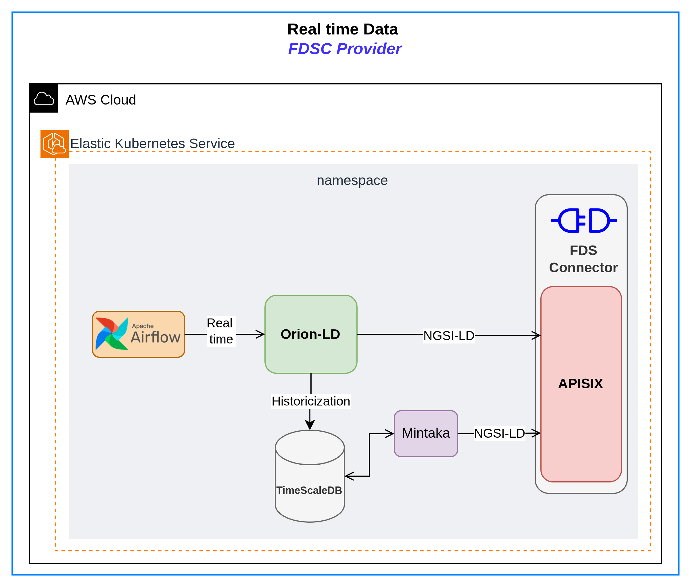

## Overview

This data flow brings together climate data from multiple agencies and institutions that provide information in real time or near real time. Specifically, the climate agencies that hold real-time data relevant to the PGTEC project, given their national scope, are:

- [AEMET](../../data_sources/metadata_datasources/aemet_datasource.md) (Agencia Estatal de Meteorología)
- [SIAR](../../data_sources/metadata_datasources/siar_datasource.md) (Sistema de Información Agroclimática para el regadío) 
- [CHJ](../../data_sources/metadata_datasources/siah_datasource.md) Confederación Hidrográfica del Júcar
- AVAMET Agencia Valenciana de Meteorología

To enable effective data sharing within the data space, it is not enough to simply collect information from different sources. The data must be continuously updated, expressed in a standardised format and made easily accessible to different organisations and applications.

For this purpose, a structured data flow is defined, covering several consecutive stages from data acquisition at the source to its storage and distribution within the data space. This flow ensures that each dataset follows a consistent process of collection, translation, standardisation, management and historical persistence, allowing it to be reliably integrated into the overall data ecosystem.

### Components of the data flow

The different components or services used to implement the real-time data flow are presented below.

- **[Airflow](https://airflow.apache.org/):** An orchestration tool that allows you to schedule and automate data collection tasks. It is responsible for periodically executing scripts that query APIs or download files from different sources. This service makes it possible to obtain near real-time data at regular intervals, continuously updating climate information and enabling early response to adverse phenomena.

- **[Orion-LD (Context Broker)](https://fiware-orion.readthedocs.io/en/master/):** A Context Broker that stores real-time data generated by Airflow in JSON-LD format. Each time new data is received from data platforms, it is written to Orion-LD, updating the entity values with the most recent information. It is the central component of the data flow, acting as the main data manager.

- **[TimeScaleDB](https://github.com/timescale/timescaledb/blob/main/README.md):** A solution designed by [TigerData](https://www.tigerdata.com/) to store temporal and spatial data, as historical information is also required in order to generate maps or train predictive models. It is an extension of a Postgres SQL database ready to store time-series related data. Orion-LD is responsible for inserting the data into the database, preserving real-time values before they are overwritten by newer updates. This is achieved through the use of TROE (Temporal Representation of Entities), which is natively supported by Orion-LD.

- **[Mintaka](https://hub.docker.com/r/fiware/mintaka):** A component that enables efficient querying of historical data stored in TimeScaleDB. It acts as a query service that retrieves data from the TimeScale database in an optimized manner and returns it in NGSI-LD format.

- **[APISIX](https://apisix.apache.org/):** An API Gateway that acts as the single entry point to the data space services. It is responsible for handling authentication, authorization and request routing, ensuring that only authorized users or services can access internal components. This component is already in the Fiware Data Space Connector.

### Stages of data flow

The data lifecycle comprises several stages, from the initial distribution of data across different sources to its incorporation into the ecosystem after passing through an ETL (Extract-Transform-Load) processing stage that cleans and standardises it. The stages are as follows:

- **Data collection:** Climate data is collected periodically from different sources, mostly through REST APIs, although some comes from direct downloads from web pages. This process is automated with Apache Airflow, which, thanks to the use of DAGs (Directed Acyclic Graphs) in Python, allows dependencies to be defined, execution to be scheduled (e.g., hourly) and regular, reliable data updates to be ensured.

- **Standardisation and translation:** Each source uses different variables and formats, so it is necessary to unify names, units, and structures. This task is performed at the end of the data collection phase. When the data is already downloaded, the scripts translate the data into common models defined by FIWARE's Smart Data Models. For further details, see the section below [Smart Data Models](../../SmartDataModels/index.md).

- **Contextual management and distribution:** Standardised data is managed by the Orion-LD Context Broker, which stores and distributes it in JSON-LD format. This makes it easier for multiple applications or services to consume it consistently.

- **Historical and analytical persistence:** Finally, real-time data is stored in a time-series database through Orion-LD using TROE component. In this way, complete records are built that allow different data space participants such as IIAMA to train machine learning and deep learning models, which are key to the prediction and early detection of adverse climate phenomena.

To visually understand the data flow, a flow chart has been created that captures the passage of data between the different components of the flow and the interactions between them.

{ width="1200" }

As can be seen in the image, all historical data is stored in TimeScaleDB. To access this data, Mintaka must be used, as it is designed to perform optimised queries on the database. Requests for real-time data can be made directly to Orion-LD. Therefore, depending on the required data, requests must be made to either component.