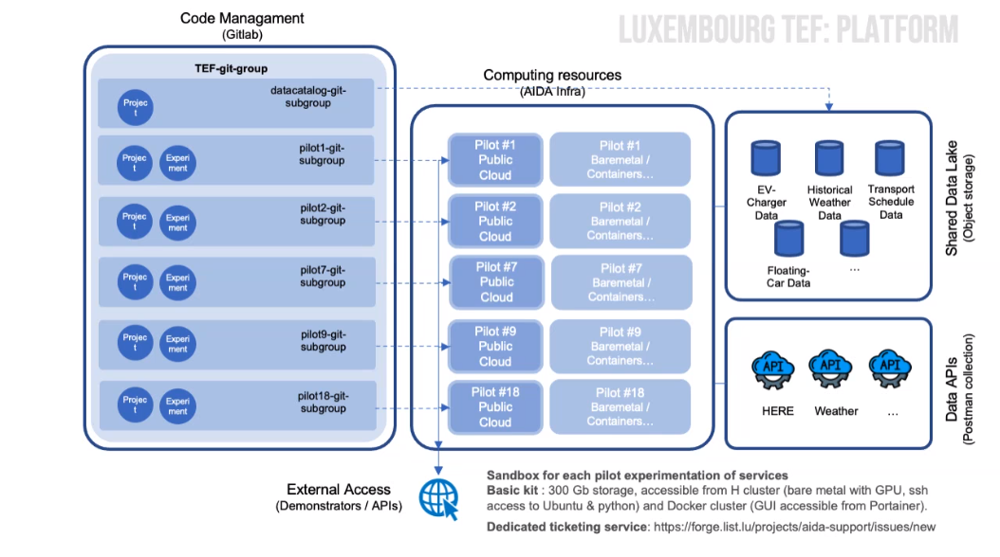

## Overview

The LIST TEF Site is located in Belval, Luxembourg and is dedicated to advancing research and development in Digital Twin technologies. This site is equipped with state-of-the-art infrastructure and is a key site in the CitCom.ai project, facilitating collaboration between cities and comunities, industrial partners (AI innovators) and research institutions.

## Services Offered

- **Digital maturity Assessment**: Guidance and support to cities and AI innovators in scoping the best-fitted AI approach, according to their needs, context and maturity. This service, which outcome is a tailored development plan for a proofof-concept, is delivered through two participatory working sessions with relevant profiles of the customer.
- **Digital Twin Scoping**: Guidance and support to cities and AI innovators in scoping the best-fitted DT approach, according to their needs, context and maturity. This service, which outcome is a tailored development plan for a proofof-concept, is delivered through two participatory working sessions with relevant profile of the customer.
- **Exploratory data Analysis**: Assessing the fit for purpose of existing data sets of the customer. The customer gets an analysis this set of data: i.e. the data fitness for their purpose and its visualization either in the form of charts or of a dashboard.
- **AI sandbox**: Supporting decision-making for cities to select a LLM for their chatbot or improve the existing.
- **Large-Scale visualization**: A customized service to allow for the exploration and analysis of large and complex datasets, supporting collaborative decision-making.
- **Proof-of-concept**: Tailored development of AI and data analytic proof-of-concept.
- **Smart cities club Luxembourg**: Smart cities club Luxembourg network of experts in Smart cities involving city representatives for reflection and common proposal around their challenges and needs.
- **Local Digital Twin Electromobility toolbox**: A true digital twin in electromobility to determine the best location for BEV charging station. This LDT can be customised on demand according to specific cities needs and challenges.
- **ViPV Simulator**: A simulator tool to quantify real potential of PV energy generation by running vehicles using weather and built-up data, that can be used by e.g. public transportation providers to support their decisionmaking towards adopting on-board photovoltaic technology.
- **Optimal EV**: A service to assess the opportunity and feasibility of solar panel on fleet.

## Infrastructure Components

Describe the key infrastructure components available at the TEF Site, including data platforms, local digital twins, specific hardware, IoT platforms, or any other relevant technologies.

- **Data Platforms**: [Description of the data platforms available]
- **Local Digital Twins**: [Details about any local digital twin infrastructure]
- **Specific Hardware**: [Details about specialized hardware available, such as sensors, servers, etc.]
- **IoT Platforms**: [Information about IoT systems or platforms in use at the site]
- **Visualization platforms**: [Information about large scale visualisation components]
- **Other**: [Any other relevant infrastructure to showcase]

<table>
  <tr>
    <th colspan="2" style="text-align: center;">Specifications</th>
  </tr>
  <tr>
    <td><strong>Data Broker<strong></td>
    <td>
      &lt;no_specified> 
      <strong>- API:</strong> &lt;no_specified> 
      <strong>- Version:</strong> &lt;no_specified>
    </td>
  </tr>
  <tr>
    <td><strong>Data Source<strong></td>
    <td>&lt;no_specified></td>
  </tr>
  <tr>
    <td><strong>IdM &amp; Auth<strong></td>
    <td>&lt;no_specified></td>
  </tr>
  <tr>
    <td><strong>Data Publication<strong></td>
    <td>&lt;no_specified></td>
  </tr>
</table>

### Architecture

Provide a high-level overview of the architecture of the TEF Site, including the key components and technologies used. Include any relevant diagrams or visualizations to help stakeholders understand the infrastructure.

### European Data Space for Smart Communities (DS4SSCC)
<!-- 
{{ config.extra.labels.ds4ssc_compliant.yes_comp.data_sources }} {{ config.extra.labels.ds4ssc_compliant.yes_comp.data_broker }} {{ config.extra.labels.ds4ssc_compliant.yes_comp.data_api }} {{ config.extra.labels.ds4ssc_compliant.no_comp.data_idm_auth }} {{ config.extra.labels.ds4ssc_compliant.no_comp.data_publication }}

 -->

## Relevant datasets of the site

Describe the relevant datasets available at the site

- **Dataset_1**: SWIO Charging Station data
- **Dataset_2**: [Description of the data set and link to Data Catalog: eg https://citcomai-hub.github.io/data_catalog/metadata_datasets/south_spain_valencia/]
- **Dataset_3**: [Description of the data set and link to Data Catalog: eg https://citcomai-hub.github.io/data_catalog/metadata_datasets/south_spain_valencia/]

## Key Stakeholders and Partners

Provide a list of the key stakeholders and partners involved in the TEF Site. Include any academic institutions, industry collaborators, and other stakeholders.

- **City of Differdange**: The city provides data about their current EV charging and PV generation infrastructure.
- **TICE**: Bus operator company for the South of Luxembourg country.
- **SWIO**: Charging Station provider for the city of Esch-sur-Alzette.

## Contact Information

Provide contact details for those responsible for the TEF Site or who can provide more information to collaborators or users.

- **Site Coordinator**: Andrés Meléndez Imaz, andres.melendez@list.lu
- **Technical Support**: Andrés Meléndez Imaz, andres.melendez@list.lu
- **General Inquiries**: Thomas Tamisier, thomas.tamisier@list.lu

## Additional Information

Any other relevant information that might be useful to collaborators or developers working with the TEF Site, such as specific protocols, access instructions, or unique capabilities.

Example:
The TEF Site offers unique capabilities in [specific field], and it is open to collaboration with other EU projects in the area of [related field].

## Documentation and Resources

Link to any relevant documentation or resources, such as technical specifications, API documentation, or guides for using services at the TEF Site.

- [Documentation Link 1](#)
- [Documentation Link 2](#)

---

!!! info
    This page is part of the documentation hub for the CitCom.ai project. Please ensure that the information is up-to-date and accurate.

