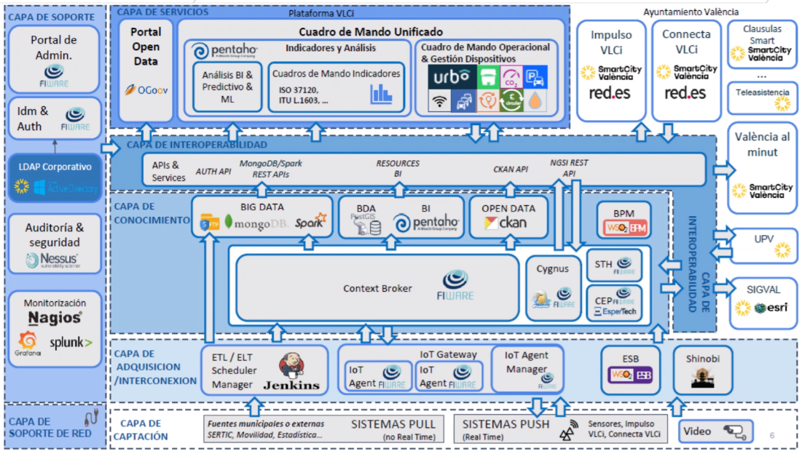

## Overview

The Valencia TEF site, part of the South Supernode, supports AI-driven innovations in pollution management, noise monitoring, waste and water management, urban development, and tourism. Led by the Valencia City Council (VALE) and València Innovation Capital (LNAV), the TEF provides essential physical and virtual infrastructures, smart city datasets, ecosystem engagement, algorithm expertise, and regulatory compliance support. Key facilities include La Harinera and Las Naves, both serving as innovation hubs, while a citywide sensor network and the VLCi Data Platform offer real-time and historical data for AI experimentation. 

## Services Offered

Valencia stands at the forefront of AI innovation within the South Supernode, offering a unique combination of resources and expertise. Key assets include the Las Naves facilities, which foster ecosystem engagement and collaboration, and the Urban Sandbox for AI, which supports real-world testing and regulatory compliance. The city's universities drive AI algorithm creation and validation, while S2Grupo provides specialized cybersecurity services. Additionally, the VLCi Data Platform offers access to a rich array of urban data, and the collaborative environment facilitates use case scoping and definition for impactful AI solutions. 

- **Service 1: Dissemination and communication of AI activities**    
  This service focuses on promoting the achievements of the Valencia TEF through events such as workshops, webinars, and presentations. It attracts stakeholders and fosters a community of interest, showcasing AI innovations effectively.

- **Service 2: Development and testing of AI algorithms**    
  The public universities within the consortium offer comprehensive development and testing of AI algorithms, with a focus on data privacy and system optimization, for stakeholders like startups and research institutions.
  
- **Service 3: Valencia VLCi Platform and datasets**    
  For CitCom.ai project, an independent instance of the VLCi platform (Valencia Urban Platform) has been created and shared with the partners with the aim of testing and experimenting in a controlled environment not only restricted to the partners but also to AI     innovators. A guidelines manual has been created for that purpose. 

## Infrastructure Components

Describe the key infrastructure components available at the TEF Site, including data platforms, local digital twins, specific hardware, IoT platforms, or any other relevant technologies.

- **Data Platforms**: [Description of the data platforms available]
- **Local Digital Twins**: [Details about any local digital twin infrastructure]
- **Specific Hardware**: [Details about specialized hardware available, such as sensors, servers, etc.]
- **IoT Platforms**: [Information about IoT systems or platforms in use at the site]
- **Visualization platforms**: [Information about large scale visualisation components]
- **Other**: [Any other relevant infrastructure to showcase]

<table>
  <tr>
    <th colspan="2" style="text-align: center;">Specifications</th>
  </tr>
  <tr>
    <td><strong>Data Broker<strong></td>
    <td>
      {{config.extra.labels.data_brokers.fiware}} 
      <strong>- API:</strong> {{config.extra.labels.api_brokers.ngsi_v2}} 
      <strong>- Version:</strong> Scorpio
    </td>
  </tr>
  <tr>
    <td><strong>Data Source<strong></td>
    <td><a href="https://documenter.getpostman.com/view/513743/RWgqVJkL">Fiware IoT-Agent</a></td>
  </tr>
  <tr>
    <td><strong>IdM &amp; Auth<strong></td>
    <td>Keycloak</td>
  </tr>
  <tr>
    <td><strong>Data Publication<strong></td>
    <td>CKAN</td>
  </tr>
</table>

### Architecture

Provide a high-level overview of the architecture of the TEF Site, including the key components and technologies used. Include any relevant diagrams or visualizations to help stakeholders understand the infrastructure.

### European Data Space for Smart Communities (DS4SSCC)

<!-- {{ config.extra.labels.ds4ssc_compliant.yes_comp.data_sources }} {{ config.extra.labels.ds4ssc_compliant.yes_comp.data_broker }} {{ config.extra.labels.ds4ssc_compliant.yes_comp.data_api }} {{ config.extra.labels.ds4ssc_compliant.no_comp.data_idm_auth }} {{ config.extra.labels.ds4ssc_compliant.no_comp.data_publication }}

 -->

## Relevant datasets of the site

Describe the relevant datasets available at the site

- **Dataset_1**: [Description of the data set and link to Data Catalog: eg https://citcomai-hub.github.io/data_catalog/metadata_datasets/south_spain_valencia/]
- **Dataset_2**: [Description of the data set and link to Data Catalog: eg https://citcomai-hub.github.io/data_catalog/metadata_datasets/south_spain_valencia/]
- **Dataset_3**: [Description of the data set and link to Data Catalog: eg https://citcomai-hub.github.io/data_catalog/metadata_datasets/south_spain_valencia/]

## Key Stakeholders and Partners

Provide a list of the key stakeholders and partners involved in the TEF Site. Include any academic institutions, industry collaborators, and other stakeholders.

- **Stakeholder 1**: [Name and description of the stakeholder, e.g., university, research institute, industry partner]
- **Stakeholder 2**: [Description]
- **Stakeholder 3**: [Description]

## Contact Information

Provide contact details for those responsible for the TEF Site or who can provide more information to collaborators or users.

- **Site Coordinator**: [Name and contact details]
- **Technical Support**: [Name and contact details]
- **General Inquiries**: [Name and contact details]

## Additional Information

Any other relevant information that might be useful to collaborators or developers working with the TEF Site, such as specific protocols, access instructions, or unique capabilities.

Example:
The TEF Site offers unique capabilities in [specific field], and it is open to collaboration with other EU projects in the area of [related field].

## Documentation and Resources

Link to any relevant documentation or resources, such as technical specifications, API documentation, or guides for using services at the TEF Site.

- [Documentation Link 1](#)
- [Documentation Link 2](#)

---

!!! info
    This page is part of the documentation hub for the CitCom.ai project. Please ensure that the information is up-to-date and accurate.
