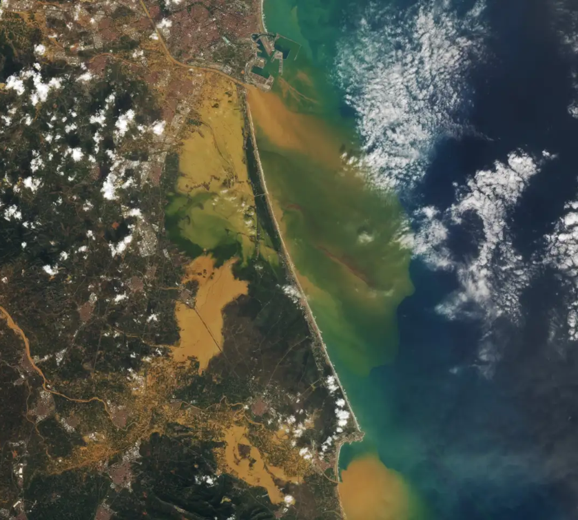

This site serves as a comprehensive **documentation** hub for the **PGTEC** project.  

## About PGTEC

Following the terrible consequences of the 2024 DANA floods in the province of Valencia, PGTEC aims to develop a platform for climate emergency prevention and management, providing advanced tools for the collection, analysis and modelling of environmental and climate data. This solution is integrated into interoperable data spaces, allowing public administrations, emergency management agencies and companies in the climate sector to access real-time information for decision-making.

This project is part of the call for sectoral data spaces from the Data Space Reference Centre [(CRED)](https://cred.digital.gob.es/inicio), under the Ministry for Digital Transformation and Public Administration, within the products and services programme.

### Platform
The platform will contribute to the **digitalization** of the climate resilience and emergency management sector, fostering the creation of **data-driven products** and **services** aligned with the principles of the **European Data Strategy** and the Recovery, Transformation and Resilience Plan.

### Beneficiary sectors
- Emergency management and civil protection
- Environment and climate change  
- Public administration and smart cities 
- Mobility and logistics

### Technologies

To ensure interoperability, trust, and security across the data space, the project integrates several core technologies. The main ones are:

- **APIs:** Various types of public and private APIs are used to collect data from different climate agencies, as well as proprietary REST APIs designed specifically for the project.

- **Digital Twins:** Different participants in the data space contribute hydrological, hydraulic and fire models to be fed with data and provide vital predictions for the prevention of climate emergencies. Other participants contribute dashboards or interactive maps to simulate real and future weather scenarios, such as IIAMA's [Water4Cast application](https://water4cast.webs.upv.es/).

- **Smart Data Models:** Data schemas used to create a common ontology to standardise all data in the data space following the JSON-LD format. For more information go to the  [Smart Data Models section](SmartDataModels/).

- **Data Spaces:** Following the developments of Fiware for data spaces, the aim of the project is to implement a trusted, interoperable and federated data space that adds value to citizens and the government when making data-based decisions in the event of a climate emergency. Notable developments include the Trust Anchor component, which acts as a police force within the data space to ensure the trust and security of participants.

- **Verifiable Credentials:** Verifiable credentials that comply with European standards and the [EUDI European wallet](https://ec.europa.eu/digital-building-blocks/sites/spaces/EUDIGITALIDENTITYWALLET/pages/694487738/EU+Digital+Identity+Wallet+Home) are used for storage to ensure total security in the data space. Each participant will have credentials with which to interact with the other participants. This ensures a reliable data space. 

- **Cloud Services:** To ensure that the platform can scale efficiently, the data space has been designed to operate in the cloud, leveraging Amazon Web Services (AWS). The project has the collaboration of the companies [Kanzo-Tech](https://kanzo.site/) and [Think-IT](https://think-it.io/) to carry out the migration to the cloud.

### Data sources

The project is designed to prevent national climate emergencies, so the climate agencies of interest will be those that have national information. In addition, following the consequences of the DANA explained above, considerable emphasis has been placed on climate agencies in the Valencian Community. Therefore, the national climate agencies that provide data for the project are:

- [Agencia Estatal de Meteorología (AEMET)](https://www.aemet.es/es/portada)
- [Sistema de Información Agroclimática para el Regadío (SiAR)](https://servicio.mapa.gob.es/websiar/)
- [Confederación Hidrográfica del Júcar (CHJ)](https://www.chj.es/es-es/Paginas/Home.aspx)
- [Agencia Valenciana de Meteorologia (AVAMET)](https://www.avamet.org/mxo-meteoxarxaonline.html)

On the other hand, the international climate agencies that have been used for the development of the project are as follows:

- [Copernicus Climate Change & Emergency](https://www.copernicus.eu/en/copernicus-services/climate-change)
- [Canadian Meteorological Centre (MSC)](https://es.wikipedia.org/wiki/Servicio_meteorol%C3%B3gico_de_Canad%C3%A1)
- [German Meteorological Centre (Deutscher Wetterdienst - DWD)](https://www.dwd.de/DE/Home/home_node.html)
- [MeteoFrance](https://meteofrance.com/)
- [Europe Centre for Medium-Range Weather Forecasts (ECMWF)](https://www.ecmwf.int/en/about)
- [National Oceanic and Atmospheric Administration (NOAA)](https://www.noaa.gov/)

### Services offered

Currently, PGTEC offers the following data related services in the data space:

- **Hydrological model [(TETIS)](https://iiama.webs.upv.es/en/technology-transfer/software/tetis/):** A spatially distributed hydrological and sediment cycle **simulation model** that divides the basin into regular cells and uses physically based parameters. As a comprehensive model, it can address **flooding** and erosion processes (with minute- or hour-level temporal resolution) as well as water-resources problems (daily resolution). It also includes a robust automatic **calibration algorithm** for both effective parameters and initial state variables, greatly simplifying practical implementation.

- **Real time Dashboard:** A dynamic, user-configurable map developed by VRAIN-UPV that visualizes different meteorological variables—such as temperature and precipitation—in real time across various locations throughout the national territory.

- **Tetis predictions Dashboard:** An interactive map developed by VRAIN-UPV to display model outputs after executing the TETIS hydrological model. It allows users to select multiple input datasets to run TETIS simulations and visualize these simulations simultaneously, enabling comparative analysis of inputs and supporting decision-making processes.

- **[Water4Cast APP](https://water4cast.webs.upv.es/):** An application developed by IIAMA designed to provide a visualization and decision-support system to predict variables and indicators relevant to the efficient management of water resource systems and river basins. The case study focuses on the Cuenca del Júcar, the main basin in the Valencian Community.

In the future, it is expected that the University of León will share the wildfire prediction model they have developed. Any additional participant joining the data space as a service provider will be incorporated accordingly.

    
    
    
    <h3 style="margin-top: 10px; font-size: 1.1em;">Image of L'Horta Sud (Valencia) Flooded After the DANA of October 29, 2024</h3>
    

!!! Tip "Next steps"

    Click on **Getting started** in the bottom navigation bar to advance to the next section.

    *You can use the buttons in the bottom navigation bar to navigate between the previous and next pages or jump to a section with the side navigation bars.*
